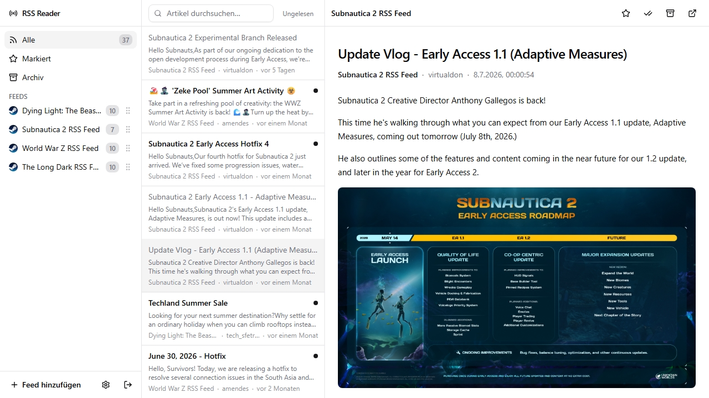

# cloudflare-based-rss-reader

A **personal, self-hosted RSS reader** that runs entirely on Cloudflare's serverless platform.

## Features

- **Free and open source** — no ads, no tracking, no paywall, no vendor lock-in. Available for Cloudflare free-tier users.
- **Modern UX** — responsive three-column layout, keyboard navigation, mobile-friendly.
- **AI summaries** — optional per-article summaries powered by Workers AI (disabled by default, togglable from Settings).

## Quick start

See **[Deployment](docs/deployment.md)** for full instructions.

## Documentation

| Document | What's inside |
| --- | --- |
| [Architecture](docs/architecture.md) | System design, data model, processing pipeline |
| [Deployment](docs/deployment.md) | Cloudflare setup, secrets, migrations, deploy steps |
| [Environment](docs/environment.md) | Env vars, bindings, local development config |
| [AGENTS.md](AGENTS.md) | Guidance for AI coding agents working in this repo |
