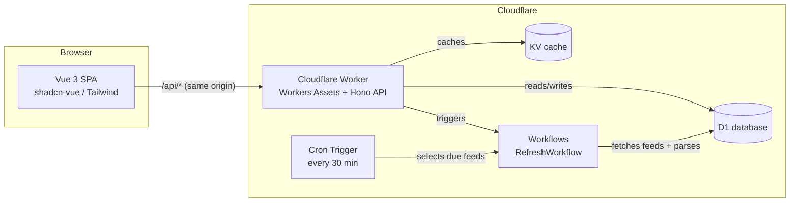

# Architecture

> This document captures the high-level architecture and key design decisions.
> It is a living document — update it as the system evolves.

## Overview

A personal, self-hosted RSS reader running entirely on Cloudflare's serverless
platform. One user. Cloudflare-native infrastructure. Vue 3 frontend, Hono API,
D1 database, Workflows for background processing.

## High-level diagram



## Deployment model

One Worker serves both the API (`/api/*`) and the built Vue SPA (Workers
Assets with `single_page_application` not-found handling). This keeps a single
deploy target, keeps the session cookie same-origin, and avoids CORS.

Local development is a single flat Vite project using the Cloudflare Vite
plugin: the Worker runtime runs on port 8787 and the Vue SPA is served as
Workers Assets from the same dev server.

## Layout

| Directory | Responsibility                                                       |
| --------- | -------------------------------------------------------------------- |
| `shared/` | Zod schemas, domain types, constants, pure utilities, compatibility  |
| `server/db/`  | Drizzle schema, client factory, SQL migrations, test mocks       |
| `server/feeds/` | Feed fetch (ETag/backoff/retry), parse, normalize, dedupe, pipeline |
| `server/routes/` | Hono API routes (auth, feeds, entries, search, opml, settings, favicon) |
| `server/`  | Hono app, middleware, GitHub OAuth, session handling, Worker entry  |
| `src/`     | Vue 3 SPA (shadcn-vue, Tailwind, Pinia, TanStack Query)             |
| `test/`    | bun test suite (db, feeds, api)                                     |

## Feed processing pipeline

```
Download -> Normalize -> Deduplicate -> Extract metadata -> Generate preview
-> Store -> Index -> Cache
```

Each step is a pure, testable module in `server/feeds`.

## Background processing

- **Cron Trigger** (`*/30 * * * *`): the Worker's `scheduled` handler selects
  due feeds (`next_fetch_at <= now`) and starts one `RefreshWorkflow` instance.
- **RefreshWorkflow** (Workers): chunks the feed ids and refreshes each chunk
  in a `step.do` with platform retries + a timeout. `refreshFeeds` is
  idempotent (guids + conditional requests), so retries are safe.
- **OPML import** creates feed rows immediately and delegates fetching to the
  same workflow.
- Each feed fetch writes a `fetch_logs` row (success/not_modified/error) for
  the diagnostics view; feeds are marked `broken` after 3 consecutive errors.

## API surface (REST + Hono + Zod)

- `/api/auth/*` — GitHub OAuth login, callback, me, logout
- `/api/feeds` — CRUD + refresh, list with unread counts
- `/api/folders` — folder CRUD with counts
- `/api/entries` — paginated list (feed/folder/starred/archived/unread
  filters), detail, flag updates (read/starred/archive), bulk updates
- `/api/search` — FTS5 full-text search
- `/api/opml` — OPML export/import
- `/api/settings` — key/value app settings (GET/PUT)
- `/api/favicon` — proxy + KV-cache site favicons (avoids hotlinking/CORS)
- `/api/push` — Web Push subscription lifecycle (capability, VAPID key,
  create/update/remove subscription, cleanup)
- `/api/health` — liveness + DB probe

## Data model

- `feeds` — feed URL, metadata, ETag/Last-Modified, health, folder ref
- `feed_folders` — subscription folders
- `entries` — article metadata (title, url, guid, author, published_at, ...)
- `entry_contents` — full HTML content, separated for light list queries
- `tags` / `entry_tags` — user tags
- `read_status` — read/unread + archived state
- `starred` — starred (saved / read-later)
- `refresh_jobs` — background refresh job bookkeeping
- `fetch_logs` — per-feed fetch diagnostics
- `users` / `sessions` — the single allowed GitHub user + auth sessions
- `settings` — key/value app settings
- `push_subscriptions` — one per-device Web Push subscription
- `notification_deliveries` — idempotent new-article notification ledger
- `entries_fts` — FTS5 full-text search index

## Authentication

GitHub OAuth, single-user. Flow:

1. `GET /api/auth/login` -> redirect to GitHub authorize with state (KV).
2. `GET /api/auth/callback` -> exchange code, fetch user, verify
   `github_id === ALLOWED_GITHUB_USER_ID`, upsert user, create session.
3. Session token (random 256-bit) stored SHA-256-hashed in D1, delivered as an
   HttpOnly, Secure, SameSite=Lax cookie.
4. `GET /api/auth/me` returns the current user; `POST /api/auth/logout` deletes
   the session.

## Performance strategy

- Lazy-loaded routes & code-splitting (Vue Router dynamic imports).
- Virtualized entry lists.
- Optimistic updates in TanStack Query mutations.
- Cache headers on API responses; KV for favicons and fetched bodies.
- Image lazy loading; memoization with VueUse/Vue computed.

## See also

- `docs/quick-start.md` — setup and deployment
- `docs/contribute.md` — development workflow and conventions
